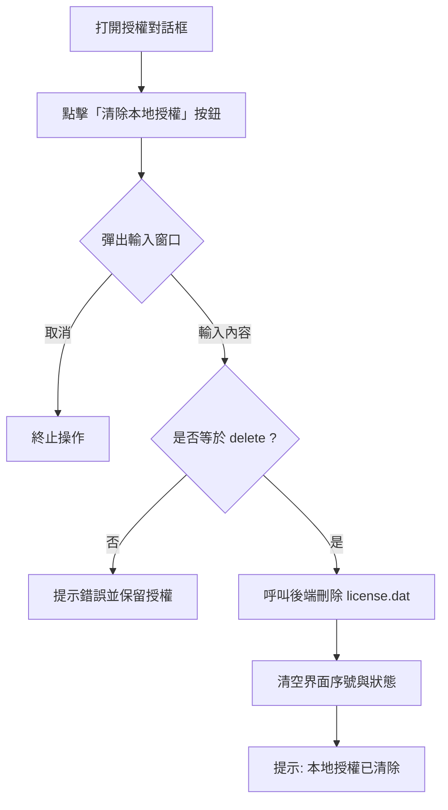

# 授權清除功能修改流程 (Clear License Flow)

本文檔說明了在 Canto-beats 授權對話框中增加「清除本地授權」按鈕及其驗證機制的修改流程。

## 1. 目標
允許用戶從界面直接清除本地授權文件（`license.dat`），並增加強制性驗證碼輸入 (`delete`) 以防止誤操作。

## 2. 修改範圍

### 核心邏輯層 (`src/core/license_manager.py`)
- **新增方法**: `LicenseValidator.clear_license()`
  - 功能：檢查 `license.dat` 是否存在，若存在則將其刪除。
- **新增方法**: `LicenseManager.clear_license()`
  - 功能：封裝驗證器的清除邏輯，提供給 UI 調用。

### 界面層 (`src/ui/main_window.py`)
- **UI 更新**: 
  - 在左上角「檔案」菜單中增加一個名為「清除本地授權...」的選項。
- **邏輯實現**:
  - 綁定點擊事件至 `self._clear_license`。
  - 使用 `QInputDialog.getText` 彈出窗口要求用戶輸入 `delete`。
  - 核對輸入：只有完全匹配 `delete` 時才執行清除。
  - 清除後處理：彈出成功提示，並更新狀態列。

## 3. 用戶操作流程 (User Flow)



## 4. 代碼示例 (擬稿)

### UI 確認函數
```python
def confirm_clear_license(self):
    from PySide6.QtWidgets import QInputDialog
    text, ok = QInputDialog.getText(self, "二次確認", "請在下方輸入 'delete' 以確認清空本地授權：")
    
    if ok and text == "delete":
        self.license_manager.clear_license()
        self.key_input.clear()
        self.log_status("[OK] 本地授權已成功清除")
    elif ok:
        QMessageBox.warning(self, "驗證失敗", "輸入不正確，授權未被清除。")
```

## 5. 驗證清單
- [ ] 點擊按鈕後是否正確彈出輸入框？
- [ ] 輸入錯誤內容時，`license.dat` 是否依然存在？
- [ ] 輸入 `delete` 後，文件是否被刪除，且界面狀態同步更新？
- [ ] 取消輸入框時是否無副作用？
