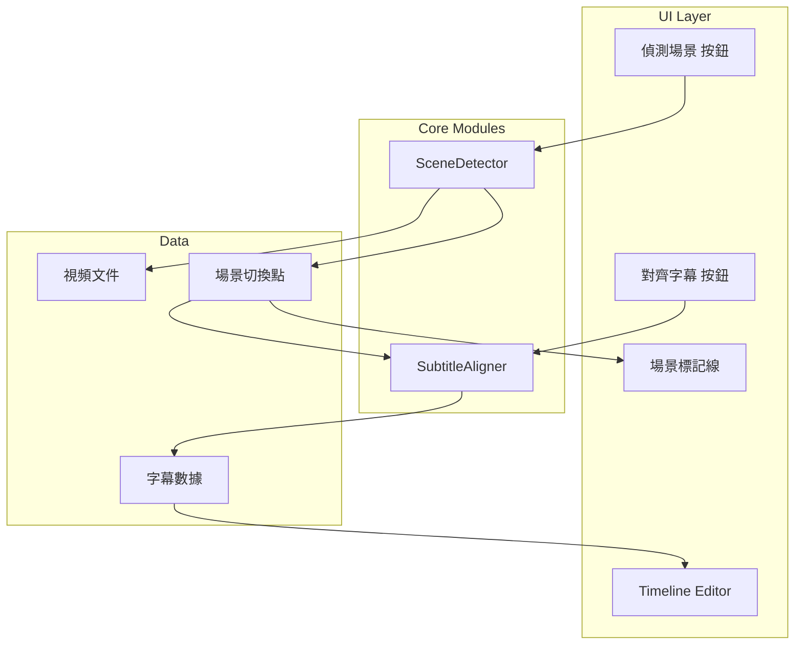

# 場景對齊字幕功能 (Scene-Based Subtitle Alignment)

## 目標
實現類似影片剪接軟件嘅「Auto Scene Cut」功能，自動偵測視頻場景切換點，並將字幕時間對齊到最近嘅場景邊界。

## 背景
傳統字幕斷句依賴語音識別同語法分析，但有時會同畫面節奏唔配合。透過分析視頻場景切換，可以令字幕同畫面更加同步，提升觀看體驗。

---

## User Review Required

> [!IMPORTANT]
> **依賴項選擇**: 場景偵測需要 OpenCV。Canto-beats 已經有 `opencv-python` 作為依賴（用於視頻縮圖提取），所以唔需要額外安裝。

> [!WARNING]
> **效能考慮**: 場景偵測需要逐幀分析視頻，對於長視頻可能需要一定時間。計劃採用以下優化策略：
> - 抽樣分析（每 0.1 秒分析一幀）而非逐幀
> - 異步處理，避免阻塞 UI
> - 進度回調

---

## Proposed Changes

### Core Module - SceneDetector

#### [NEW] [scene_detector.py](file:///c:/Users/ktphi/.gemini/antigravity/playground/canto-beats/src/models/scene_detector.py)

新增視頻場景偵測模組：

```python
class SceneDetector:
    """
    視頻場景切換偵測器。
    
    使用 OpenCV 分析影格差異，偵測場景切換點。
    """
    
    def __init__(self, threshold: float = 30.0, min_scene_duration: float = 0.5):
        """
        Args:
            threshold: 場景切換閾值 (0-100)，越低越敏感
            min_scene_duration: 最短場景持續時間 (秒)
        """
    
    def detect_scenes(
        self, 
        video_path: str,
        sample_interval: float = 0.1,
        progress_callback: Callable = None
    ) -> List[SceneCut]:
        """
        偵測視頻中嘅場景切換點。
        
        Returns:
            SceneCut 列表，每個包含 timestamp 同 confidence
        """
    
    def _calculate_frame_difference(
        self, 
        frame1: np.ndarray, 
        frame2: np.ndarray
    ) -> float:
        """
        計算兩幀之間嘅差異分數。
        使用色彩直方圖比較算法。
        """
```

**核心算法**：色彩直方圖比較
```python
# 1. 將影格轉換為 HSV 色彩空間
hsv1 = cv2.cvtColor(frame1, cv2.COLOR_BGR2HSV)
hsv2 = cv2.cvtColor(frame2, cv2.COLOR_BGR2HSV)

# 2. 計算直方圖
hist1 = cv2.calcHist([hsv1], [0, 1], None, [50, 60], [0, 180, 0, 256])
hist2 = cv2.calcHist([hsv2], [0, 1], None, [50, 60], [0, 180, 0, 256])

# 3. 比較直方圖 (Correlation 方法)
score = cv2.compareHist(hist1, hist2, cv2.HISTCMP_CORREL)

# 4. 轉換為差異分數 (0-100)
difference = (1 - score) * 100
```

---

### Core Module - SubtitleAligner

#### [NEW] [subtitle_aligner.py](file:///c:/Users/ktphi/.gemini/antigravity/playground/canto-beats/src/models/subtitle_aligner.py)

新增字幕對齊模組：

```python
@dataclass
class AlignmentResult:
    """對齊結果"""
    index: int           # 字幕索引
    original_start: float
    original_end: float
    aligned_start: float
    aligned_end: float
    aligned_to_scene: bool  # 是否有對齊到場景

class SubtitleAligner:
    """
    將字幕時間對齊到場景切換點。
    """
    
    def __init__(self, tolerance: float = 0.5):
        """
        Args:
            tolerance: 對齊容差 (秒)，字幕時間喺呢個範圍內會被對齊
        """
    
    def align_to_scenes(
        self,
        subtitles: List[Dict],
        scene_cuts: List[SceneCut],
        mode: str = 'nearest'  # 'nearest', 'start_only', 'end_only'
    ) -> List[AlignmentResult]:
        """
        將字幕對齊到場景切換點。
        
        Args:
            subtitles: 字幕列表 [{'start': float, 'end': float, 'text': str}]
            scene_cuts: 場景切換點列表
            mode: 對齊模式
            
        Returns:
            對齊結果列表
        """
```

**對齊策略**：

| 模式 | 描述 |
|------|------|
| `nearest` | 字幕開始/結束都嘗試對齊最近場景 |
| `start_only` | 只對齊字幕開始時間 |
| `end_only` | 只對齊字幕結束時間 |

---

### UI Integration

#### [MODIFY] [timeline_editor.py](file:///c:/Users/ktphi/.gemini/antigravity/playground/canto-beats/src/ui/timeline_editor.py)

修改 Timeline Editor，加入場景標記同對齊功能：

**1. 工具欄新增按鈕**
```python
# 在 _create_toolbar() 中添加
self.scene_detect_btn = create_icon_button("scene", "偵測場景切換", True)
self.scene_detect_btn.clicked.connect(self._detect_scenes)
toolbar_layout.addWidget(self.scene_detect_btn)

self.align_btn = create_icon_button("align", "對齊到場景", False)
self.align_btn.clicked.connect(self._align_subtitles_to_scenes)
toolbar_layout.addWidget(self.align_btn)
```

**2. 場景標記繪製**
```python
# 在 TimelineTrack.paintEvent() 中添加
def _draw_scene_markers(self, painter, start_sec, end_sec):
    """繪製場景切換標記線"""
    painter.setPen(QPen(QColor(255, 165, 0), 2))  # 橙色
    for scene_cut in self.scene_cuts:
        if start_sec <= scene_cut.timestamp <= end_sec:
            x = int(scene_cut.timestamp * self.pixels_per_second)
            painter.drawLine(x, 0, x, self.height())
```

**3. 新增方法**
```python
def set_scene_cuts(self, scene_cuts: List[SceneCut]):
    """設置場景切換點"""
    self.scene_cuts = scene_cuts
    self.align_btn.setEnabled(len(scene_cuts) > 0)
    self.update()

def _detect_scenes(self):
    """異步偵測場景切換"""
    # 顯示進度對話框
    # 調用 SceneDetector
    # 設置場景標記
    
def _align_subtitles_to_scenes(self):
    """將字幕對齊到場景"""
    # 調用 SubtitleAligner
    # 記錄操作到 edit_history (支持撤銷)
    # 更新字幕顯示
```

---

### Resources

#### [NEW] [scene.svg](file:///c:/Users/ktphi/.gemini/antigravity/playground/canto-beats/src/resources/icons/scene.svg)

新增場景偵測按鈕圖標 (影格符號)

#### [NEW] [align.svg](file:///c:/Users/ktphi/.gemini/antigravity/playground/canto-beats/src/resources/icons/align.svg)

新增對齊按鈕圖標 (對齊線符號)

---

## Architecture Diagram



---

## Verification Plan

### Automated Tests

```bash
# 單元測試 - SceneDetector
python -m pytest tests/test_scene_detector.py -v

# 單元測試 - SubtitleAligner
python -m pytest tests/test_subtitle_aligner.py -v
```

### Manual Verification

1. **場景偵測測試**
   - 載入有明顯場景切換嘅視頻
   - 點擊「偵測場景」按鈕
   - 確認 Timeline 上顯示橙色場景標記線
   - 標記位置應該對應視頻嘅場景切換

2. **字幕對齊測試**
   - 先完成場景偵測
   - 點擊「對齊字幕」按鈕
   - 確認字幕時間有被調整
   - 測試撤銷 (Ctrl+Z) 功能

3. **效能測試**
   - 測試 1 分鐘視頻偵測時間 (目標: < 5 秒)
   - 測試 10 分鐘視頻偵測時間 (目標: < 30 秒)

---

## Implementation Order

1. ✨ `SceneDetector` 核心模組
2. ✨ `SubtitleAligner` 核心模組  
3. 🎨 SVG 圖標資源
4. 🔧 Timeline Editor UI 整合
5. ✅ 測試同驗證
